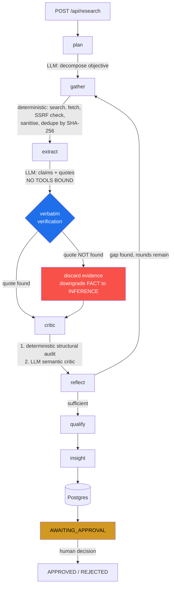

# Groundwork

**An evidence-grounded research agent. Every claim is labelled `FACT` / `INFERENCE` / `UNKNOWN`, and every `FACT` is traced to a quote verified — character by character — against the page it came from.**

```
Objective ──▶ Plan ──▶ Search & Fetch ──▶ Extract ──▶ Critic ──▶ Reflect ──▶ Qualify ──▶ Human review
                          ▲                                          │
                          └──────────── "I need more evidence" ──────┘
```

---

## Why this exists

Most "AI research agents" return fluent prose. Prose cannot be audited. You cannot tell which sentence came from a source, which the model inferred, and which it invented — so you cannot trust any of it, and you cannot *measure* whether it is improving.

Groundwork forces a different output shape. The system may only assert **claims**, and every claim must declare how it is known:

| Status | Meaning | Requirement |
| --- | --- | --- |
| `FACT` | A retrieved source explicitly states this | **Must** carry a quote verified verbatim against the fetched page |
| `INFERENCE` | Reasoned from evidence; no source states it directly | Shown as reasoning, never as fact |
| `UNKNOWN` | Relevant, looked for, not established | An honest non-answer |

A claim asserted as `FACT` whose quote does not appear in the source is **automatically downgraded** — by deterministic string matching, not by asking another model whether the first model was honest. That single mechanism is what makes the evaluation metrics here meaningful.

### The concept was changed deliberately

The original brief was lead generation ("find companies that could benefit from AI automation"). I changed the core framing for one engineering reason: **"could benefit from AI automation" is unfalsifiable.** You cannot build a benchmark for it, so you cannot demonstrate the system works. Grounded claim extraction *is* measurable, so evaluation becomes real rather than decorative.

Lead qualification survives as one *use case* of a general engine — the `criteria` field and the `qualify` node — rather than as the whole product.

---

## Run it in 60 seconds

Default providers are **offline fakes**. No API key, no cost, no network.

```bash
git clone <your-fork-url> && cd groundwork
python -m venv .venv && source .venv/bin/activate
pip install -e ".[dev]"
cp .env.example .env

make test          # full suite, no network, no keys
python scripts/demo.py   # see a realistic annotated run, no API key needed
make run           # http://localhost:8000
```

For real research:

```bash
LLM_PROVIDER=anthropic
SEARCH_PROVIDER=tavily
ANTHROPIC_API_KEY=sk-ant-...
TAVILY_API_KEY=tvly-...
```

With Postgres: `docker compose up --build`

---

## Architecture



### Where the LLM is used — and where it deliberately is not

This is the core design judgement of the project ([ADR-002](docs/architecture-decisions/ADR-002-agent-boundaries.md)).

| Decision | Owner | Reasoning |
| --- | --- | --- |
| What to search for | **LLM** | Real language understanding |
| Whether to search again | **LLM**, hard-bounded | Real judgement, but must terminate |
| What a page claims | **LLM** | Reading comprehension |
| Is a quote genuine? | **Code** | String matching is exact, free, and cannot be argued with |
| Source quality tier | **Code** | A rule you can state in one sentence beats a model call |
| Duplicate detection | **Code** | SHA-256 |
| Act on the result | **Human** | Consequential and irreversible |

There are no "researcher / analyst / writer" sub-agents. That architecture looks better in a diagram and performs worse: three LLM calls where one function plus one call is cheaper, faster and lower-variance.

---

## The agentic loop is real

`reflect` is a genuine conditional edge, not a fixed pipeline step. It inspects gathered evidence and either stops or emits **new, gap-targeted queries**:

```python
def route_after_reflect(state: ResearchState) -> str:
    return "gather" if state.get("should_continue_research") else "qualify"
```

Bounded three ways, because an agent that can loop must terminate for reasons independent of the model's judgement:

1. `max_search_rounds` — checked *before* the LLM call, so the model cannot argue for another round
2. LangGraph `recursion_limit=50` — framework backstop
3. Fail-closed error containment (below)

### Three real bugs found in review

**1. Fail-open error containment caused an infinite loop.**

During development, a raising `reflect` node returned only `{"errors": [...]}`. That left `should_continue_research` at its previous value — `True` — so **a failing node caused an infinite research loop** until the recursion limit tripped. In production each iteration costs money.

The fix generalises: *error containment must also reset any state the router depends on.*

```python
graph.add_node("reflect", traced(
    "reflect", partial(reflect_node, llm=llm),
    error_update={"should_continue_research": False},  # fail closed
))
```

Covered by `test_node_exception_is_contained`.

**2. Sources with no verified evidence were re-extracted every round.**

"Already processed" was *derived* from the evidence list. A source whose quotes all failed verbatim verification produces no evidence — so it looked unprocessed, was re-extracted on every subsequent round, and appended duplicate claims. One source began to look like several corroborating ones, which is precisely the failure this project exists to prevent.

Fixed by tracking `processed_source_ids` explicitly in graph state. The lesson: *derived state is a lie whenever the thing you derive it from is allowed to be empty.* Covered by `test_source_is_not_reextracted_across_rounds`.

**3. The critic re-audited every earlier claim on each new round.**

Claims accumulate across rounds, but the critic ran over *all* of them each time — duplicating critic notes, overwriting confidence repeatedly, and spending tokens re-judging settled claims. Found by running `scripts/demo.py` and noticing notes that read `"Quote states the claim. | Quote states the claim."`

Fixed by skipping claims that already carry a verdict. Worth noting the test suite did **not** catch this — a demo exercising the real graph did. Now covered by `test_claims_are_not_reaudited_across_rounds`.

---

## Security model

The system fetches attacker-controllable pages and puts their text into an LLM prompt. That is both a prompt-injection and an SSRF surface. Both are addressed; neither is claimed solved.

### Prompt injection — defence in depth

| Layer | Mechanism |
| --- | --- |
| **Capability isolation** | Extraction and critic LLM calls have **no tools bound**. This is the layer that actually matters: a perfect injection has nothing to call. |
| **Structural isolation** | Untrusted text is wrapped in a **nonce-tagged** block (`<WEB_CONTENT id="a3f9…">`). A static delimiter can be closed by an attacker writing `</document>`; a per-call random nonce cannot be guessed from inside the page. |
| **Detection** | Seven pattern families: instruction override, role injection, chat markup, tool coercion, exfiltration, verdict coercion, hidden directives. Flagged sources are **down-tiered and surfaced in the UI**. |
| **Neutralisation** | Zero-width and bidi-override characters stripped; fake role markers and chat-template tokens defanged — *without deleting words*, so quotes still verify. |
| **Evidence rejection** | The critic marks any claim whose evidence comes only from injection-flagged pages as `UNSUPPORTED`. |

**Residual risk, stated plainly:** a sufficiently novel injection can still influence what the extractor reports. The mitigation that holds regardless is capability isolation — influencing the *text* of a claim is bounded damage when the system cannot take actions. Detection is heuristic and will have false negatives.

### SSRF

An agent fetching model-suggested URLs is an SSRF primitive; on cloud hosts `169.254.169.254` serves IAM credentials.

- Scheme allowlist (`http`/`https` only)
- Blocks loopback, private, link-local, multicast, reserved ranges, and cloud metadata IPs
- **DNS rebinding defence:** the hostname is resolved and *every* returned address is checked — a hostname-only blocklist misses `evil.com → 127.0.0.1`
- Credentials-in-URL rejected; redirects capped at 3; responses capped at 5 MB

### Other controls

Optional `X-API-Key` with **constant-time comparison** (a naive `!=` leaks key material via timing) · per-IP sliding-window rate limit on the paid endpoint · secret-redaction filter on all log output · `extra="forbid"` on every schema · non-root Docker user.

---

## Evaluation

> ### ⚠️ Benchmark status: **not yet run against a live model**
>
> The harness, scorers and an 8-task benchmark set are implemented and tested. **No real-provider results are published, because I have not run them yet.** To generate them:
>
> ```bash
> make eval          # writes docs/eval-results.md — measured numbers only
> make eval-fake     # smoke-tests the harness at zero cost
> ```
>
> `run_eval.py` contains no placeholder table and no example numbers. If it has not run, `docs/eval-results.md` does not exist. **Inventing benchmark results would invalidate the entire premise of a project about grounding.**

### What is measured

Metrics are split by trustworthiness and labelled as such:

**Intrinsic — deterministic, fully reproducible:**
- **Quote verification rate** — share of model-produced quotes that actually appear in the source. *The most direct measure of fabrication.*
- **Evidence coverage** — share of `FACT` claims carrying a verified quote
- Latency, LLM calls, token counts, estimated cost

**Referenced — against hand-written dataset expectations:**
- **Known-false claim count** — per-task canary strings. Any value above zero is an uncaught hallucination.
- Expected-entity recall

**Partly LLM-judged — treat as indicative:**
- Unsupported-claim rate from the critic

There is deliberately **no single "factual accuracy" score.** It would be the most impressive-sounding number here and the least trustworthy: an LLM judge's output reported as ground truth.

### The benchmark set

8 tasks in `src/groundwork/evaluation/datasets/benchmark.jsonl`, including three adversarial:

- **`nonexistent-company`** — researches a company that does not exist. Correct behaviour is `UNKNOWN` claims and `INSUFFICIENT_EVIDENCE`. *The most diagnostic task in the set.*
- **`contradictory-figures`** — sources genuinely disagree; tests whether contradiction is surfaced or silently resolved
- **`injection-canary`** — pages about prompt injection legitimately contain injection strings

---

## Testing

**104 tests, 87% coverage, all offline.** No API keys, no network, no runtime downloads.

```
tests/test_security.py    28  injection detection, nonce isolation, SSRF, DNS rebinding
tests/test_grounding.py   19  verbatim verification, epistemic downgrade, referential integrity
tests/test_workflow.py    26  end-to-end, agentic loop, dedup, provider failures, schema repair
tests/test_api.py         15  HITL gating, auth, persistence, validation
tests/test_evaluation.py  15  scorers, dataset integrity, honest-reporting guarantees
```

Failure tests map to real production failure modes:

| Test | Failure mode |
| --- | --- |
| `test_fabricated_quote_is_discarded_and_claim_downgraded` | Model invents a quote |
| `test_injected_page_is_flagged_and_downtiered` | Malicious page content |
| `test_blocks_dns_rebinding` | SSRF via DNS |
| `test_malformed_json_is_repaired` | Invalid structured output |
| `test_persistently_malformed_output_raises` | Repair loop gives up cleanly |
| `test_search_failure_does_not_crash_run` | Search API down |
| `test_node_exception_is_contained` | Node raises mid-graph |
| `test_loop_is_bounded_by_max_rounds` | Runaway agent loop |
| `test_duplicate_content_is_collapsed` | Syndicated copies faking corroboration |
| `test_second_decision_is_refused` | Double-click overwriting a reviewer |

Note `test_benign_business_text_is_not_flagged`: the injection detector is tested for **false positives** too. An over-eager regex silently degrades research quality by down-tiering good sources.

---

## Project layout

```
src/groundwork/
├── domain/          Pydantic schemas + epistemic enums     ← the spine
├── security/        sanitize.py (injection) · ssrf.py
├── providers/       llm.py · search.py  (+ Fake implementations)
├── agent/
│   ├── graph.py     LangGraph assembly, conditional edge
│   ├── prompts.py   all prompts, one file
│   └── nodes/       plan · gather · extract · critic · reflect
├── persistence/     SQLAlchemy models + repository
├── evaluation/      scorers · run_eval · benchmark.jsonl
└── main.py          FastAPI, auth, rate limiting, HITL gate
```

Eight ADRs in `docs/architecture-decisions/` record *why* each significant choice was made — including the ones rejected.

---

## Limitations

Stated because a portfolio project claiming no weaknesses is not credible.

1. **Not hallucination-free.** Verbatim verification catches *fabricated* quotes with certainty. It does **not** catch a real quote used misleadingly, and `INFERENCE` claims can simply be wrong. The system reduces and *labels* unsupported content.
2. **Confidence scores are uncalibrated.** Kept as a relative signal, never thresholded on. ([ADR-005](docs/architecture-decisions/ADR-005-confidence-and-uncertainty.md))
3. **No published benchmark results yet.** See above.
4. **`create_all()` is not a migration strategy.** Production needs Alembic.
5. **Background jobs are in-process asyncio tasks.** A restart loses running jobs; real deployment needs a queue.
6. **Rate limiting is per-process.** Multi-worker needs Redis.
7. **HTML extraction is minimal** and dependency-free — worse recall than trafilatura on complex pages.
8. **The injection detector is heuristic** and English-biased; it will have false negatives.
9. **Traces are in-memory** and lost on restart.
10. **Source tiering is a domain-suffix rule**, so it misjudges unusual sites.

## Future work

Alembic migrations · Redis-backed queue and rate limiting · Langfuse exporter via the existing `on_span` hook · pgvector for cross-run entity resolution (only if a real need appears — see [ADR-008](docs/architecture-decisions/ADR-008-normalised-persistence.md)) · human-labelled ground truth to calibrate confidence · multilingual injection patterns for Dutch and German sources.

---

## Interview notes

Questions this project invites, and where the answers live:

- *"How do you know the agent isn't hallucinating?"* → verbatim verification in `extract.py`, plus limitation 1
- *"Why not multi-agent?"* → ADR-002 and the cost/reliability argument
- *"How do you defend against prompt injection?"* → four layers, capability isolation being the one that matters (ADR-006)
- *"How do you evaluate an LLM system?"* → metric trustworthiness tiers, adversarial tasks, and refusing to publish a single fake accuracy number
- *"Tell me about a bug you found."* → two, both below

MIT licensed.
